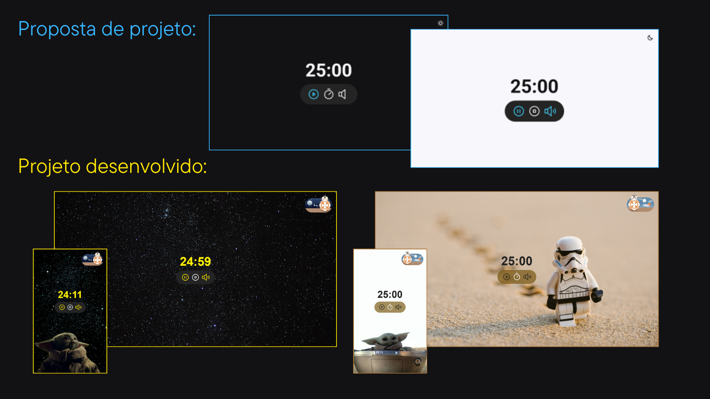

<h1 align="center"> Focus Timer 🕐 </h1>

  * A aplicação é um temporizador responsivo com funções de iniciar, pausar, resetar e com possibilidade de ajuste dos minutos do contador pelo usuário. Contém sons para os comandos e para avisar quando o contador zerar, além da opção de som de fundo!
  
  * O desafio proposto era um projeto com Layout simples mas optei por fazer com o tema Star Wars! 

  * Link da aplicação: https://beatriz-gm.github.io/FocusTimer/

## Tecnologias utilizadas:
- Figma
- HTML
- CSS
- JavaScript

# By: [Beatriz Galvão](https://www.linkedin.com/in/beatriz-galmed/) 🖤
